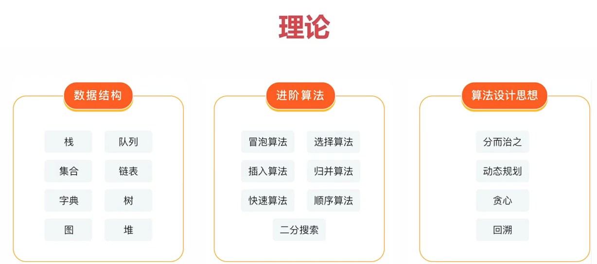
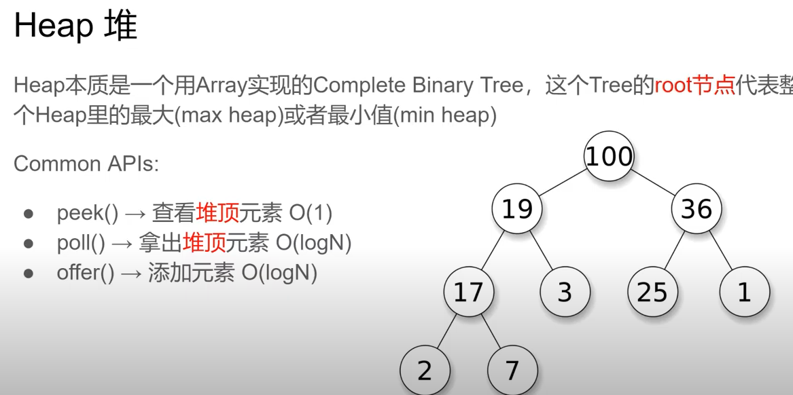

# 数据结构与算法
What is a data structure?

a data structure(DS) is a way of organizing data so that it can be used efficiently.

算法 Algorithm: is a way of solving a problem by using a set of instructions. 算法是一种解决问题的方法。

- 非常棒的视频分享课： https://www.youtube.com/watch?v=RBSGKlAvoiM&t=1661s
- b站的切割视频： https://www.bilibili.com/video/BV1eS4y1v7qc?spm_id_from=333.999.0.0&vd_source=747a8ff9c723e281e4b23bbc83a47dfd
- 视频课程： https://www.youtube.com/watch?v=FVoOh6zxEDY&list=PLwIrqQCQ5pQmjH6YyFvH2A9FYL6bBB4Ra
理论：



- 重点关注：数据结构和算法的特点，应用场景，时间和空间复杂度。
- 刷题：建议分类刷题，相当于集中训练。
- 重点关注：通用套路，时间和空间复杂度分析。


### 关系

- 数据结构：计算机存贮，组织数据的方式。
- 算法：一些列解决问题的清晰指令，就像食谱。
- 程序 = 数据结构 + 算法。
- 数据结构为算法提供服务，算法围绕数据结构操作。


### 主要学习的数据结构
- 栈、队列、链表
- 集合、字典
- 树、堆、图

### 主要关注点
- 链表：遍历链表，删除链表节点
- 树、图：深度、广度优先遍历
- 数组： 冒泡、选择、插入、归并、快速排序； 顺序、二分搜索。

### 复杂度

#### 时间复杂度


- O(1) 只会执行一次

```js
let i = 0;
i+=1
```

- O(n) 时间复杂度
```js
for(let i=0; i<n; j+=1) {
    console.log(n)
}
```

如果两个时间复杂度并列，则两个需要相加。O(X)+O(Y)
则下面这个复杂度是 O(1) + O(n)。但是当n足够大的时候，1可以忽略不计。

```js
let i=0;
i +=1;
for(let i=0; i<n; j+=1) {
    console.log(n)
}
```

- O(n) * O(n) = O(n^2)  注意相乘和相加不一样
```js
for(let i=0; i<n; j+=1) {
    for(let i=0; i<n; j+=1) {
        console.log(i,j)
    }
}
```

- O(logN)
  
```js
let i = 1;
while(i<n) {
    console.log(i); // 执行了logN 次
    i *=2;
}
```

#### 空间复杂度
算法在运行过程中临时占用的内存空间大小的量度

- O(1)
```js
let i = 0; // 占用的内存是单个变量，是一个恒定的值。永远是1
i+=1;
```
- O(n)
```js
const list = []; // 声明这个数组，添加了n个值，相当于占用n个内存单元
for(let i=0; i<n; j+=1) {
   list.push(i);
}
```

- O(n^2)
```js
const matrix = []; // 矩阵
for(let i=0; i<n; i+=1) {
    matrix.push([]);
  for(let j=0; j<n; j+=1) {
     matrix[i].push(j)
  }
}
```

# 栈
一个**后进先出**的数据结构。javascript 中没有栈，但我们可以用`array`实现栈的所有功能。
;

只能在栈顶进行插入和删除，是一种受限的数据结构。

javascript 中实现栈结构的方法：
- 基于数组实现
- 基于链表的实现

常见的使用场景：**所有后进先出的场景，比如：十进制转换为二进制，判断字符串的括号有效，函数调用堆栈**。
- 十进制转换为二进制
- eg 有效的长度 还可以使用字典来优化。时间复杂度O(n)，空间复杂度：O(n)


后出来的余数反而要排到前面，把余数依次放到栈中，就可以实现余数倒序输出。

  


- 有效的括号
  左括号入栈，右括号出栈，如果出栈的括号不是左括号，则说明不是有效的括号。
  

- 函数调用堆栈 call stack
 


# 队列

一个**先进先出**的数据结构。javascript 中没有队列，但我们可以用`array`实现队列的所有功能。
在后端rear插入，前端font删除0。


javascript 中实现队列结构的方法：
- 基于数组实现
- 基于链表的实现

使用场景：所有需要先进先出的场景，保证有序性。eg: 食堂排队打饭

- js 引擎利用队列来实现 异步任务队列

js 是单线程的，无法同时执行多个任务，所以需要一个队列来保证任务的执行顺序。

 

- 计算最近的请求次数 


### 1: 优先级队列

优先级队列是一种特殊的队列，其中的元素是按照一定的优先级排列的。不同与普通队列，优先级队列插入需要做比较。
插入的数据应该包含优先级，不再是一个普通的数据。因此只有插入方法不同。

应用的场景：
- 实现一个简单的调度器，比如：调度器，调度算法，调度算法的优先级，调度算法的执行顺序。
- 急诊科，登机顺讯。
- 线程队列。

  
# 链表
链表：一个简单的数据结构，它提供了一种链式存储方式，允许我们在任意位置插入、删除、查找等操作。
元素的存储是不连续的。


和数组的区别：
- 数组是连续的，需要申请连续的内存空间，但是js中本身是可以动态扩容的。
- 增删改查的时间复杂度都是O(1)，但是链表的插入、删除、查找的时间复杂度都是O(n)。
- 增删非收尾元素时数组需要重新分配内存，链表不需要。链表只需要修改指针即可。

# 二叉树

在线可视化网站
- http://btv.melezinek.cz/binary-search-tree.html
- https://visualgo.net/en/bst
- 二叉树分类： https://www.zoo.team/article/binary-heap-with-js

满二叉树肯定是一颗完全二叉树。

 


# heap 堆
 


 堆排序是排序算法中的一种，算法时间复杂度是O(n log(n))。heapify操作完成堆排序

堆必须满足完全二叉树，并且满足堆的性质：
- 堆的每个`parent`值都大于或等于其左右孩子的值。
- 叶子节点必须是从左边开始
- 构建堆可以从h-1层开始，也就是倒数第二层，这样可以从最小的堆逐渐到稳定态的堆，变成一颗完整的堆。

以下全是完全二叉树。
 

 

向下取整，保留整数的部分。
 


# 其他

### 1: 2进制
```js
const num = 10; // 1010
// 转换为2进制
const bNumber = num.toString(2);

// 转换为10进制
const number = parseInt(bNumber,10); 

const cbNumber = 0b1010; //  js 的表示方式2进制的表示方法

1010 >> 1; // 右移动可以理解为除以2，整体向右移动一位，移动的位数是1。前面补0。得到的结果是：0101(5)
```

### 2: 更好的写法
```js
var num = (right + left)/2; 
// 两种写法一个效果，下面的更加安全，不会造成溢出。
var num2 = left + (right-left)/2;
```


