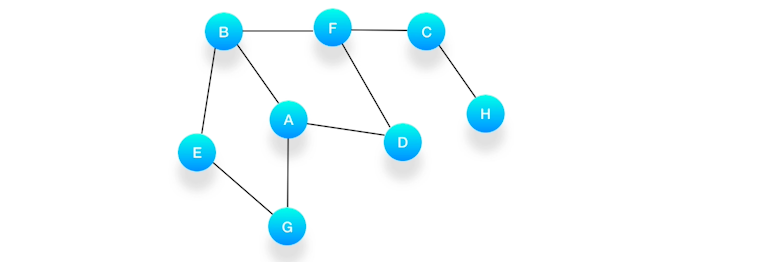

## 广度优先遍历 breadth-first traverse

广度优先搜索，一般用来解决最短路径的问题。和深度优先搜索不同，广度优先的搜索是从起始点出发，一层一层地进行，每层当中的点距离起始点的步数都是相同的，当找到了目的地之后就可以立即结束。

广度优先搜索算法（又称宽度优先搜索）是最简便的图的搜索算法之一。

`BFS` 搜索结果是一个队列，每次从队列中取出一个节点，然后将其所有的相邻节点加入队列中，可以结合可视化来观察实现，实现非常的巧妙。

广度优先的搜索可以同时从起始点和终点开始进行，称之为双端 BFS。这种算法往往可以大大地提高搜索的效率。

举例：在社交应用程序中，两个人之间需要经过多少个朋友的介绍才能互相认识对方。

解法：

- 只从一个方向进行 BFS，有时候这个人认识的朋友特别多，那么会导致搜索起来非常慢；
- 如果另外一方认识的人比较少，从这一方进行搜索，就能极大地减少搜索的次数；
- 每次在决定从哪一边进行搜索的时候，要判断一下哪边认识的人比较少，然后从那边进行搜索。


依赖队列（Queue），先进先出（FIFO）。


```js
  // 这个写法也是常见的非递归遍历的写法
 function breadthFirstSearch(value) {
    let queue = [this];
    while (queue.length) {
      let node = queue.shift();
      if (node.value === value) return node;
      if (node.left) queue.push(node.left);
      if (node.right) queue.push(node.right);
    }
    return null;
  }
```

## 深度优先遍历 depth-first search
深度优先搜索，从起点出发，从规定的方向中选择其中一个不断地向前走，直到无法继续为止，然后尝试另外一种方向，直到最后走到终点。就像走迷宫一样，尽量往深处走。

DFS 解决的是连通性的问题，即，给定两个点，一个是起始点，一个是终点，判断是不是有一条路径能从起点连接到终点。

起点和终点，也可以指的是某种起始状态和最终的状态。问题的要求并不在乎路径是长还是短，只在乎有还是没有。有时候题目也会要求把找到的路径完整的打印出来。

一般是在图的概念，在二叉树中也同样适用。

必须依赖栈解构 `Stack` 先进后厨`LIFO`。


### 常见的几类形式

- 前序遍历：根结点 ---> 左子树 ---> 右子树
- 中序遍历：左子树---> 根结点 ---> 右子树
- 后序遍历：左子树 ---> 右子树 ---> 根结点

怎么区分这几类遍历方式: **即前序、中序、后序是相对于根节点来说的，根节点在前，就是前序，根在中间就是中序，根在最后就是后序；并且总是先左后右读取。**


- 前序遍历：100-90-80-92-101-100-102
- 中序遍历：80-90-92-100-100-101-102
- 后序遍历：80-92-90-100-102-101-100


### 例题 

假设我们有这么一个图，里面有 A、B、C、D、E、F、G、H 8 个顶点，点和点之间的联系如下图所示，对这个图进行深度优先的遍历。



- 1: 选择一个起始顶点，例如从顶点 A 开始。把 A 压入栈，标记它为访问过（用红色标记），并输出到结果中。
  


- 2: 第二步，寻找与 A 相连并且还没有被访问过的顶点，顶点 A 与 B、D、G 相连，而且它们都还没有被访问过，我们按照字母顺序处理，所以将 B 压入栈，标记它为访问过，并输出到结果中。


- 3: 第三步，现在我们在顶点 B 上，重复上面的操作，由于 B 与 A、E、F 相连，如果按照字母顺序处理的话，A 应该是要被访问的，但是 A 已经被访问了，所以我们访问顶点 E，将 E 压入栈，标记它为访问过，并输出到结果中


- 4: 第四步，从 E 开始，E 与 B、G 相连，但是 B 刚刚被访问过了，所以下一个被访问的将是 G，把 G 压入栈，标记它为访问过，并输出到结果中。


- 5: 第五步， 现在我们在顶点 G 的位置，由于与 G 相连的顶点都被访问过了，类似于我们走到了一个死胡同，必须尝试其他的路口了。所以我们这里要做的就是简单地将 G 从栈里弹出，表示我们从 G 这里已经无法继续走下去了，看看能不能从前一个路口找到出路。


- 6：第六步，现在栈的顶部记录的是顶点 E，我们来看看与 E 相连的顶点中有没有还没被访问到的，发现它们都被访问了，所以把 E 也弹出去。
- 7：第七步，当前栈的顶点是 B，看看它周围有没有还没被访问的顶点，有，是顶点 F，于是把 F 压入栈，标记它为访问过，并输出到结果中。
- 8： 第八步，当前顶点是 F，与 F 相连并且还未被访问到的点是 C 和 D，按照字母顺序来，下一个被访问的点是 C，将 C 压入栈，标记为访问过，输出到结果中。
- 9：第九步，当前顶点为 C，与 C 相连并尚未被访问到的顶点是 H，将 H 压入栈，标记为访问过，输出到结果中。
- 10： 第十步，当前顶点是 H，由于和它相连的点都被访问过了，将它弹出栈。
- 11：第十一步，当前顶点是 C，与 C 相连的点都被访问过了，将 C 弹出栈。
- 12： 第十二步，当前顶点是 F，与 F 相连的并且尚未访问的点是 D，将 D 压入栈，输出到结果中，并标记为访问过。
- 13： 第十三步，当前顶点是 D，与它相连的点都被访问过了，将它弹出栈。以此类推，顶点 F，B，A 的邻居都被访问过了，将它们依次弹出栈就好了。最后，当栈里已经没有顶点需要处理了，我们的整个遍历结束。


```js
 function depthFirstSearch(value) {
    if(this.value === value) return this;
    if(value < this.value ) {
        if(!this.left) return null;
        return this.left.depthFirstSearch(value);
    }
    else {
        if(!this.right) return null;
        return this.right.depthFirstSearch(value);
    }
  }
```


## 参考文章

https://wuwhs.gitee.io/2020/11/08/algorithm-dfs-bfs/
